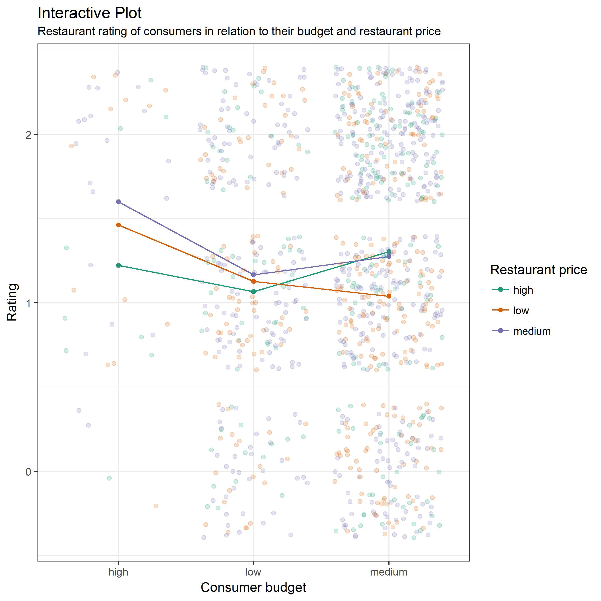

## **Project Overview**
Difference in consumer budget and restaurant actual price may affect consumer's rating for restaurants. In this project, I will analyze whether this difference actually leads to different ratings, using linear regression model. 

My explanatory variables are restaurant price and consumer budget. My response variable is rating.

## Data Description
For this analysis, I used *[Restaurant Data with Consumer Ratings](https://www.kaggle.com/uciml/restaurant-data-with-consumer-ratings)* from Kaggle. I chose 3 datasets over 9 that are available in the source. These are:
- geoplaces2.csv: this file contains information for many restaurants around Mexico, with 130 observations (rows) and 21 attributes (columns). For my analysis purpose, I chose attributes `placeID` and `price` from this file. There is no missing values from these 2 attributes. 
  - `price` is a categorical variable with 3 levels: low, medium, high.

- userprofile.csv: this file contains information of consumers who came to those restaurants, with 138 observations and 19 attributes. For my analysis purpose, I chose attributes `userID` and `budget` from this file. There are 7 missing values from `budget`, which were removed from my final dataset.
  - `budget` is a categorical variable with 3 level: low, medium, high. 

- rating_final.csv: this file contains rating from each consumer to different restaurants, with 1161 observations and 5 attributes. For my analysis purpose, I choose attributes `userID`, `placeID`, and `rating` from this file. There is no missing values from thse 3 attributes. 
  - `rating` is a numerical variable with 3 values: 0, 1, 2.

## **Exploratory Analysis**
### Clean Data
I cleaned up 3 raw data files, an combimed them to create my final dataset for analysis. 

Code reference: [clean_data.R](../src/clean_data.R)

### Exploratory Plot Intepretation 


The plot suggests that:
- There is an unbalance in data for different group of consumer budget and restaurant price. This unbalance may lead to less correct result. Therefore, more data is needed in the future for this project. 
- There are some interactive relationships among different groups of consumer budget and restaurant price. Therefore, in my regression model, I use:

```
lm(rating~budget*price)
```
instead of: 

```
lm(rating~budget+price)
```
to check on the effect of this interaction on rating. 

Code reference: [exploratory_plot.R](../src/exploratory_plot.R)

## **Explanatory Analysis**
### Results


```r
read.csv("../results/regression_analysis.csv")
```

```
## Warning in file(file, "rt"): cannot open file '../results/
## regression_analysis.csv': No such file or directory
```

```
## Error in file(file, "rt"): cannot open the connection
```

Code reference: [regression_analysis.R](../src/regression_analysis.R) 

### Intepretation
- (Intercept): with p-value significant at 5%, I have evidence to say that the average rating when budget is low and restaurant price is low is different from 0. In fact, my model predicts that the average rating in this case is 1.13. This is also my **baseline** to compare with other cases. 

- budget2: rating from consumers with medium budget but went to low price restaurant is not different from the baseline, since p-value is 35% which is insignificant at 5%. 

- budget3: rating from consumers with high budget but went to low price restaurant is not different from the baseline, since p-value is 14% which is insignificant at 5%. 

- price2: rating from consumers with low budget but went to medium price restaurant is not different from the baseline, since p-value is 69% which is insignificant at 5%. 

- price 3: rating from consumers with low budget but went to high price restaurant is not different from the baseline, since p-value is 63% which is insignificant at 5%. 

- budget2:price2: rating from consumers with medium budget and went to medium price restaurant is not different from the baseline. This is because my p-value is 10% which is insignificant at 5%. 

- budget3:price2: rating from consumers with high budget but went to medium price restaurant is not different from the baseline. This is because my p-value is 73% which is insignificant at 5%. 

- budget2:price3: with p-value significant at 5% (0.029 < 0.05), I can say that consumers with medium budget but went to high price restaurant has higher rating than those with low budget and went to low price restaurant. The average rating of this group is around 1.45. 

- budget3:price3: rating from consumers with high budget and went to high price restaurant is not different from the baseline, since p-value is 62% which is insignificant at 5%. 

## **Conclusion** 
There is not necessary an effect of going to a restaurant with price different from budget on consumer rating on the restaurant. However, there is one exception when consumers with medium budget going to a high price restaurant - average consumer rating on the restaurant increase to around 1.45 compared to 1.13 when consumers with low budget going to a low price restaurant. 

This conclusion is not my final conclusion since my dataset has unbalance data for different groups of consumer budget and restaurant price, as well as the bias observations containing only restaurant in Mexico. For the future plan, I want to collect more data from around South America region to run this test again. 
